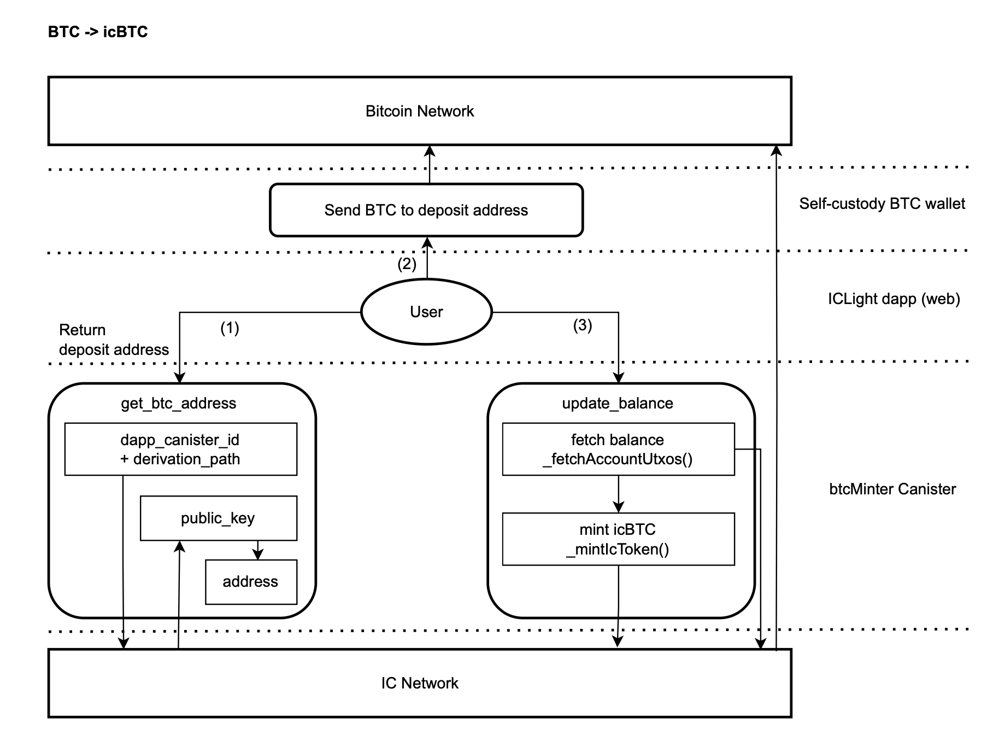
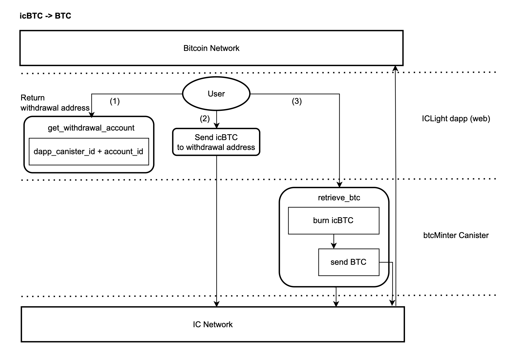

# icBTC

icRouter enables the integration of Bitcoin and IC network through the Threshold Signature Scheme (TSS, also known as chain-key technology). icBTCs are 1:1 ICRC1 tokens minted cross-chain from Bitcoin to the IC network, and you can retrieve the original BTCs at any time. this is all done in a bridgeless manner, and its security depends on the security of the IC network.

## About Bitcoin Integration

Leveraging chain-key Technology, ICP canister smart contracts can hold a Bitcoin public key, sign transactions with it, and directly read and write to the Bitcoin network. Build incredible dapps that natively interact with the Bitcoin network.

https://internetcomputer.org/bitcoin-integration

Note: icBTC is a separate version implemented by the ICLighthouse team using the above technology.

## How it works

icRouter's btcMinter Canister enables communication with the Bitcoin network by calling the chain-key interface of the IC network, which has a dedicated subnet to provide block data and threshold ECDSA signatures, and to provide consensus.

### BTC -> icBTC

Cross-chaining native BTC to the IC network requires three steps:
- (1) The user calls get_btc_address() method of btcMinter to get the deposit address, which is different for each user. It has no plaintext private key and is decentrally controlled by a dedicated subnet of the IC using TSS technology.
- (2) The user sends BTC in his/her BTC wallet to the above deposit address.
- (3) After waiting for transaction confirmation, the user calls update_balance() method of btcMinter to mint the corresponding icBTC in IC network. Native BTC UTXOs are controlled by the btcMinter canister, and the 1:1 corresponding icBTC are ICRC1 tokens on the IC network.



### icBTC -> BTC

Retrieving native BTC from the IC network requires three steps.
- (1) The user gets the withdrawal address of icBTC (owner is btcMinter canister-id, subaccount is user account-id), or he can call btcMinter's get_withdrawal_account() method to get it (this is a query method, so you need to pay attention to its security).
- (2) The user sends icBTC to the above withdrawal address and burns them.
- (3) The user calls btcMinter's retrieve_btc() method to provide his/her BTC address and retrieve the native BTC. In this process, the BTCs that were originally stored in the btcMinter canister are sent to the destination address using the threshold signature technique.




## Dependent toolkits

### dfx

- https://github.com/dfinity/sdk/
- version: 0.21.0 (https://github.com/dfinity/sdk/releases/tag/0.21.0)
- moc version: 0.11.1

### vessel

- https://github.com/dfinity/vessel
- version: 0.7.0 (https://github.com/dfinity/vessel/releases/tag/v0.7.0)

### ic-repl

- https://github.com/dfinity/ic-repl/
- version: 0.6.2 (https://github.com/dfinity/ic-repl/releases/tag/0.6.2)
- Install to the directory `/usr/local/bin/ic-repl`

## Compiles

### btcMinter

```
dfx canister --network ic create icBTCMinter --controller __your principal__
dfx build --network ic icBTCMinter
```
- Code: "btc/src/icBTCMinter.mo"
- Module hash: 2ecc3cc389c85643e08aa3db5f84cca26e882e1386737ef94a4bd37e3cdbe6d2
- Version: 0.3.1
- Build arg: {
    "args": "--compacting-gc",
    "gzip" : true
}

## Deployment

### 1. Deploy icBTCMinter

```
dfx canister --network ic install icBTCMinter --argument '(record{retrieve_btc_min_amount=20000; min_confirmations=opt 6; fixed_fee=1000; dex_pair=null; true)'
```
args:
- initArgs:
    - retrieve_btc_min_amount : Nat64; // Minimum number of BTC that can be retrieved (satoshi).
    - min_confirmations : ?Nat32; // The minimum confirmation blocks for a transaction on bitcoin network.
    - fixed_fee : Nat; // Fixed fee (satoshi) that will be charged for each operation (mint/retrieve).
    - dex_pair: ?Principal; // icBTC trading pair on ICDex (optional).
- enDebug: Bool; // Whether to start debugging.
Note: 
- These parameters filled in will take effect each time you upgrade.
- btcMinter calls bitcoin mainnet data.

### 2. Set token wasm

**call icBTCMinter.setCkTokenWasm()**

ic-repl (/usr/local/bin/ic-repl)  

```
export IdentityName=default
export TokenVersion=1.0.0
export Minter=__icBTCMinter_canister_id__
export MinterDid=did/icBTCMinter.did
dfx build --network ic -qq icToken
cp -f .dfx/ic/canisters/icToken/icToken.wasm icTokens/
chmod +x  icTokens/setWasm.sh
icTokens/setWasm.sh
```

### 3. Launch icBTC

**call icBTCMinter.launchToken()**
```
dfx canister --network ic call icBTCMinter launchToken '(record{ totalSupply = null; ckTokenFee = 10; ckTokenName = "BTC on IC"; ckTokenSymbol = "icBTC"; ckTokenDecimals = 8 })'
```
args:
- totalSupply: ?Nat; // Maximum supply of icBTC (satoshi) - Optional.
- ckTokenFee: Nat; // The transaction fee (satoshi) for icBTC .
- ckTokenName: Text; // Token name, e.g. "BTC on IC".
- ckTokenSymbol: Text; // Token symbol, e.g. "icBTC".
- ckTokenDecimals: Nat8; // Token decimals, e.g. "8".

### 4. Config

- Start timer
```
dfx canister --network ic call icBTCMinter timerStart '(86400)'
```
arg: Nat // Timer interval (seconds).


- Start icBTCMinter
```
dfx canister --network ic call icBTCMinter setPause '(false)'
```