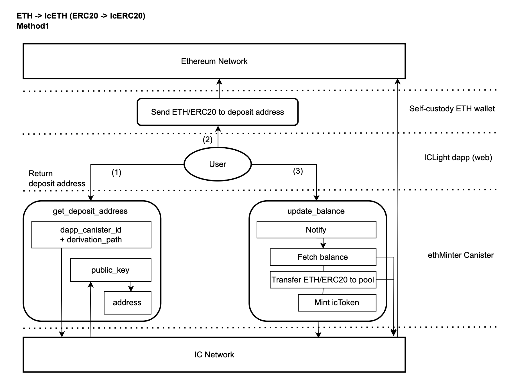
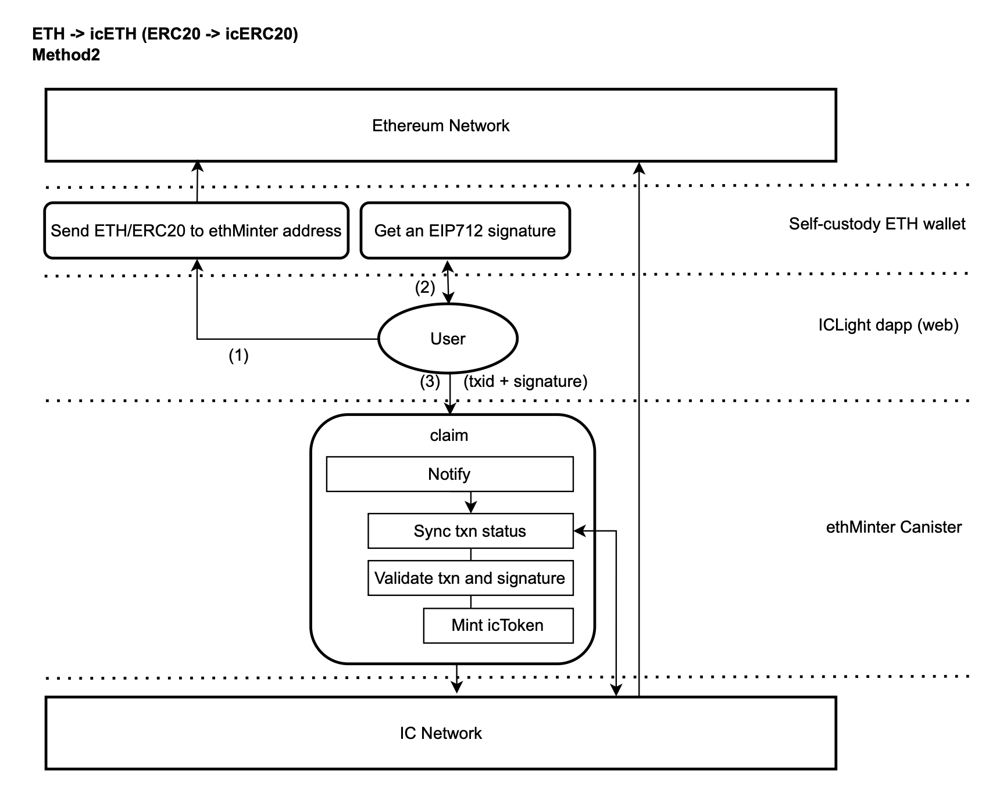
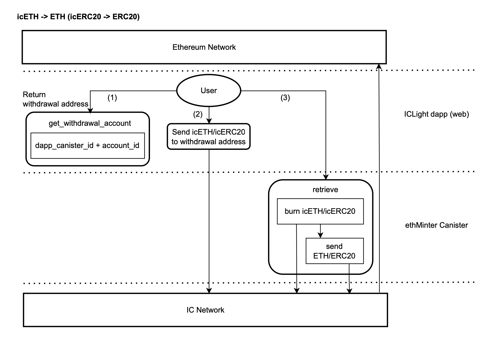

# icETH

icRouter enables the integration of Ethereum and IC network through the Threshold Signature Scheme (TSS, also known as chain-key technology). 
icETH/icERC20 are 1:1 ICRC1 tokens minted after cross-chaining from ethereum to IC network, and you can retrieve the original ethereum tokens at any time. This is all done in a bridgeless way, and their security depends on the security of IC network.

## About Ethereum Integration

A true World Computer enables a multi-chain environment where centralized bridges are obsolete and smart contracts can seamlessly communicate across blockchains. ICP already integrates with the Bitcoin and Ethereum networks.

https://internetcomputer.org/ethereum-integration

Note: icETH/icERC20 is a separate version implemented by the ICLighthouse team using the above technology.

## Concepts

### TSS and chain-key

Threshold Signature Scheme (TSS) is a multi-signature scheme that does not require the exposure of private keys and is well 
suited for 100% chain implementation of cross-chain transactions, which is also referred to as chain-key technology on IC.

### External Chain and Coordinating chain

External Chain is a blockchain that integrates with IC network, such as bitcoin network.  
Coordinating chain is the blockchain where decentralised cross-chain smart contracts are located, in this case IC.

### Original token and Wrapped token

Original tokens are tokens issued on external chain, such as ETH.  
Wrapped tokens are tokens that have been wrapped by a smart contract with a 1:1 correspondence and issued on IC, such as icETH.

### Minting and Retrieval

Minting is the process of locking the original tokens of external chain into the Minter contract of the coordinating chain 
and issuing the corresponding wrapped tokens. Retrieval is burning the wrapped tokens and sending the corresponding original 
tokens in the Minter contract to the holder.

## How it works

The integration of ethereum on the IC network without bridges is achieved through chain-key (threshold signature) technology for ECDSA signatures, and the smart contracts of IC can directly access the RPC nodes of ethereum through HTTPS Outcall technology. This is the technical solution implemented in stage 1, which can be decentralized by configuring multiple RPC API providers. 

The user sends an ethereum asset, ETH or ERC20 token, to an address controlled by the IC smart contract (Minter), which receives the ethereum asset and mint icETH or icERC20 token on the IC network at a 1:1 ratio. When users want to retrieve the real ethereum asset, they only need to return icETH or icERC20 token to Minter smart contract to retrieve the ethereum assets.

icRouter's ethMinter Canister enables communication with the external chain network by calling the chain-key interface of the IC network, which has a dedicated subnet to provide block data and threshold ECDSA signatures, and to provide consensus.

### Minting: ETH/ERC20 -> icETH/icERC20 (Method 1)

Method 1 Cross-chaining original tokens to the IC network requires three steps:
- (1) The user calls get_deposit_address() method of ethMinter to get the deposit address of external chain, which is different 
for each user. It has no plaintext private key and is decentrally controlled by a subnet of the IC using TSS technology.
- (2) The user sends original tokens in his/her wallet to the above deposit address.
- (3) After waiting for external chain transaction confirmation, the user calls update_balance() method of ethMinter to mint the 
corresponding wrapped tokens in IC network. Original tokens are controlled by the ethMinter canister, and the 1:1 corresponding 
wrapped tokens are ICRC1 tokens on the IC network.



### Minting: ETH/ERC20 -> icETH/icERC20 (Method 2)

Method 2 Cross-chaining original tokens to the IC network requires three steps:
- (1) The user sends original tokens to the ethMinter pool address, which is controlled by the ethMinter but does not 
have a plaintext private key and is decentrally controlled by a subnet of the IC using TSS technology.
- (2) The user signs an EIP712 signature in his wallet, which includes the above icRouter label, txid, the user's principal 
in IC.
- (3) The user calls ethMinter's claim() method, providing the txid and signature. ethMinter mints the corresponding 
wrapped tokens on IC after checking the parameters and blockchain data.



### Retrieval: icETH/icERC20 -> ETH/ERC20

Retrieving original tokens from the IC network requires three steps.
- (1) The user gets the withdrawal address of external chain (owner is ethMinter canister-id, subaccount is user 
account-id), or he can call ethMinter's get_withdrawal_account() method to get it (this is a query method, so 
needs to pay attention to its security).
- (2) The user sends wrapped tokens to the above withdrawal address and burns them.
- (3) The user calls ethMinter's retrieve() method to provide his/her address of external chain and retrieve the 
original tokens. In this process, the original tokens that were stored in the ethMinter canister 
are sent to the destination address using the threshold signature technique.




### RPC Whitelist and Keepers

icETHMinter sets up RPC whitelists and Keepers through governance, where Keepers submit RPC URLs. icETHMinter accesses data from multiple RPC endpoints through http_outcall and forms consensus.

RPC Whitelist: RPC domains that are allowed to be added to icETHMinter, generally common RPC providers in the market.

Keepers: users who are added to icETHMinter by governance to provide RPC URLs, they need to select RPC providers in the RPC whitelist.

## Naming rules for variables and interfaces.

- By default, small camel nomenclature (e.g., lowerCamelCase) is used.
- Snake nomenclature (e.g., snake_case) may be used to match external interface specifications, or if an external function module is referenced.
- In the case of specific prefixes, the prefix ‘xxx_’ is added, either in the hump nomenclature or in the snake nomenclature.

## Dependent toolkits

### dfx

- https://github.com/dfinity/sdk/
- version: 0.21.0 (https://github.com/dfinity/sdk/releases/tag/0.21.0)
- moc version: 0.11.1

### vessel

- https://github.com/dfinity/vessel
- version: 0.7.0 (https://github.com/dfinity/vessel/releases/tag/v0.7.0)

### ic-repl

- https://github.com/dfinity/ic-repl/
- version: 0.6.2 (https://github.com/dfinity/ic-repl/releases/tag/0.6.2)
- Install to the directory `/usr/local/bin/ic-repl`

## Compiles

### ethMinter

```
dfx canister --network ic create icETHMinter --controller __your principal__
dfx build --network ic icETHMinter
```
- Code: "eth/src/icETHMinter.mo"
- Module hash: 6284e683754b24617743c8b1d934aac816ff8946131e7db7a5a03ca539bc5c5a
- Version: 0.9.2
- Build arg: {
    "args": "--compacting-gc",
    "gzip" : true
}

## Deployment

### 1. Deploy icETHMinter

```
dfx canister --network ic install icETHMinter --argument '("Sepolia", "ETH", 18, 12, record{min_confirmations=opt 96; rpc_confirmations = 3; tx_type = opt variant{EIP1559}; deposit_method=3}, true)'
```
args:
- initNetworkName: Text // External chain network name.
- initSymbol: Text // Original token symbol.
- initDecimals: Nat8 // Original token decimals.
- initBlockSlot: Nat // External chain network block interval time in seconds.
- initArgs:
    - min_confirmations : ?Nat; // Minimum number of confirmed blocks in external chain network.
    - rpc_confirmations: Nat; // The minimum number of confirmations required to call the RPC interface to form a consensus.
    - tx_type: {#EIP1559; #EIP2930; #Legacy}; // Transaction construction.
    - deposit_method: Nat8; // Methods to cross-chain original tokens from external chain to IC network. 1 - method1 enabled; 2 - method2 enabled; 3 - method1 and method2 enabled.
- enDebug: Bool; // Whether to start debugging.

### 2. Set up RPC Whitelist and Keepers
Add default providers Alchemy, BlockPi, PublicNode, Ankr via EVM RPC Canister (https://github.com/internet-computer-protocol/evm-rpc-canister).
```
dfx canister --network ic call icETHMinter setDefaultKeepers '(vec{ "All" })'
```
Or add custom RPC providers.
```
dfx canister --network ic call icETHMinter addRpcWhitelist '("eth-sepolia.g.alchemy.com")'
dfx canister --network ic call icETHMinter addRpcWhitelist '("rpc.ankr.com")'

dfx canister --network ic call icETHMinter setKeeper '(record{owner=principal "__keeper_1_principal__"; subaccount=null}, opt "Keeper1", opt "__rpc_url_1__", variant{Normal})'
dfx canister --network ic call icETHMinter setKeeper '(record{owner=principal "__keeper_2_principal__"; subaccount=null}, opt "Keeper2", opt "__rpc_url_2__", variant{Normal})'
dfx canister --network ic call icETHMinter setKeeper '(record{owner=principal "__keeper_3_principal__"; subaccount=null}, opt "Keeper3", opt "__rpc_url_3__", variant{Normal})'
dfx canister --network ic call icETHMinter setKeeper '(record{owner=principal "__keeper_4_principal__"; subaccount=null}, opt "Keeper4", opt "__rpc_url_4__", variant{Normal})'
dfx canister --network ic call icETHMinter setKeeper '(record{owner=principal "__keeper_5_principal__"; subaccount=null}, opt "Keeper5", opt "__rpc_url_5__", variant{Normal})'
```
Note: Keeper can call keeper_set_rpc() method to reset the RPC URL and query get_keepers() method to get the latest status.

### 3. Set wrapped token wasm

**call icETHMinter.setCkTokenWasm()**

ic-repl (/usr/local/bin/ic-repl)  

```
export IdentityName=default
export TokenVersion=1.0.0
export Minter=__icETHMinter_canister_id__
export MinterDid=did/icETHMinter.did
dfx build --network ic -qq icToken
cp -f .dfx/ic/canisters/icToken/icToken.wasm icTokens/
chmod +x  icTokens/setWasm.sh
icTokens/setWasm.sh
```

### 4. Config

**Synchronise the base information of the blockchain.**
```
dfx canister --network ic call icETHMinter sync '()'
```

**Start timer**
```
dfx canister --network ic call icETHMinter timerStart '(1800, 180)'
```
arg: Nat // Timer interval (seconds).

**Start icETHMinter**
```
dfx canister --network ic call icETHMinter setPause '(false)'
```

### 5. Launch wrapped tokens

**call icETHMinter.launchToken()**
```
dfx canister --network ic call icETHMinter launchToken '(null, "icETH", record{totalSupply=null; minAmount=10000000000000000; ckTokenFee=100000000000; fixedFee=1000000000000000; gasLimit=21000; ethRatio=1000000000})'
```
args:
- token: ?EthAddress // Smart contract address for EVM token, If it is a native token, such as ETH, fill in null and default to 0x0000000000000000000000000000000000000000.
- rename: ?Text // Rename the name of the token on the IC.
- args: 
       - totalSupply: ?Wei/*smallest_unit*/; // The total supply, default is null.
       - minAmount: Wei/*smallest_unit Token*/; // Minimum number of tokens for icETHMinter operations.
       - ckTokenFee: Wei/*smallest_unit Token*/; // The floating fee charged by icETHMinter changes dynamically due to the price (ethRatio) of the token.
       - fixedFee: Wei/*smallest_unit ETH*/; // Fixed fee charged by icETHMinter.
       - gasLimit: Nat; // The blockchain network's gas limit.
       - ethRatio: Wei/*1 Gwei ETH = ? smallest_unit Token */ // The ratio of token to native token (e.g. ETH) * 1000000000.

### 6. Sets canister-id of trading pair for a wrapped token.

**Native & Quote token** (e.g. icETH & icUSDT)
```
dfx canister --network ic call icETHMinter setTokenDexPair '(variant{ETH = record{ quoteToken = "__quote_token_contract_address__"; dexPair = principal "__ canister-id of pair NativeToken/QuoteToken __"}})'
```
args: 
- quoteToken: EthAddress // Quote token contract address.
- dexPair: Principal // The canister-id of pair "NativeToken/QuoteToken".

**Other tokens**
```
dfx canister --network ic call icETHMinter setTokenDexPair '(variant{ ERC20 = record{ tokenId = "__token_contract_address__";dexPair=principal "__ canister-id of pair Token/QuoteToken __"}})'
```
args: 
- tokenId: EthAddress // The token contract address.
- dexPair: Principal // The canister-id of pair "Token/QuoteToken".

## Related technologies used

- Threshold ECDSA https://github.com/dfinity/examples/tree/master/motoko/threshold-ecdsa
- libsecp256k1 https://github.com/av1ctor/libsecp256k1.mo
